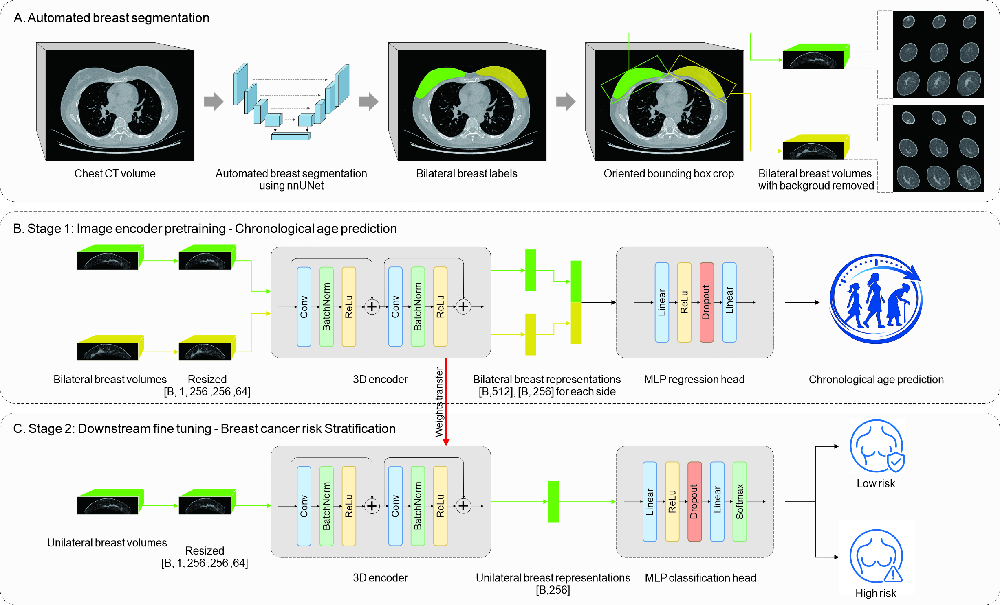

# CT Breast Manuscript Modeling Code

Official repository of COBRIS (Chest-CT Opportunistic Breast Risk Stratification):

1. **Age pretraining**: bilateral 3D CT age regression using paired left/right breast volumes.
2. **Risk stratification**: unilateral 3D CT binary classification using single breast volumes.

Both workflows use PyTorch and MONAI 3D ResNet-style backbones, MONAI `PersistentDataset` caching, TensorBoard logging, and optional distributed training with `torchrun`.

## Workflow



## Breast Segmentation

The breast segmentation model used for preprocessing is available on Hugging Face:

https://huggingface.co/huaiqiang/nnUnet_CTBreast_Segmentation

## Repository Layout

```text
.
├── Age_Pretrain/
│   ├── train_classic_DDP.py          # Bilateral age-regression trainer
│   ├── runDDP.sh                     # Example 8-GPU age pretraining command
│   ├── data/
│   │   └── bilateral_dataset.py      # CSV parsing and MONAI transforms
│   └── models/
│       └── bilateral_resnet_age.py   # Bilateral 3D ResNet regressor
└── Risk_Stratification/
    ├── Classification.py             # Unilateral classification trainer/evaluator
    ├── data/
    │   └── unilateral_dataset.py     # CSV parsing and MONAI transforms
    └── models/
        └── unilateral_resnet.py      # Unilateral 3D ResNet classifier
```

## Requirements

The project does not currently include a pinned environment file. The training scripts import:

- Python 3.10 or newer
- PyTorch with CUDA support
- MONAI
- pandas
- numpy
- scikit-learn
- TensorBoard

Example setup:

```bash
conda create -n ct-breast python=3.10
conda activate ct-breast

# Install a PyTorch build appropriate for your CUDA version first.
# See https://pytorch.org/get-started/locally/ for the exact command.

pip install monai pandas numpy scikit-learn tensorboard
```

For multi-GPU training, use a CUDA-capable PyTorch installation and launch with `torchrun`.

## Input Data

The code expects 3D medical image files readable by MONAI `LoadImaged`, such as NIfTI files. Relative paths in CSV files are resolved against `--root-dir` when provided.

All image volumes are intensity-scaled from `[-1024, 1024]` to `[0, 1]` and resized to `(256, 256, 64)`.

### Age Pretraining CSV Schema

Age pretraining uses separate training and validation CSV files with these required columns:

| Column | Description |
| --- | --- |
| `LEFT` | Path to the left breast CT volume |
| `RIGHT` | Path to the right breast CT volume |
| `age` | Numeric age regression target |

Example:

```csv
LEFT,RIGHT,age
case001/left.nii.gz,case001/right.nii.gz,56
case002/left.nii.gz,case002/right.nii.gz,63
```

Rows with missing required values are dropped. Rows referencing missing image files are also dropped.

### Risk Stratification CSV Schema

Risk stratification uses CSV files with these required columns:

| Column | Description |
| --- | --- |
| `Path` | Path to a unilateral CT volume |
| `Label` | Integer class label, usually `0` or `1` |

Example:

```csv
Path,Label
case001/left.nii.gz,0
case002/right.nii.gz,1
```

## Age Pretraining

Run from the `Age_Pretrain` directory:

```bash
cd Age_Pretrain

python train_classic_DDP.py \
  --train-csv ./DATA/Dataset_train.csv \
  --val-csv ./DATA/Dataset_val.csv \
  --root-dir ./DATA \
  --cache-dir ./cache \
  --output-dir ./runs_regression \
  --batch-size 4 \
  --epochs 50 \
  --lr 1e-4 \
  --backbone resnet50 \
  --val-every 5
```

For distributed multi-GPU training:

```bash
cd Age_Pretrain

torchrun --nproc_per_node=8 train_classic_DDP.py \
  --train-csv ./DATA/Dataset_train.csv \
  --val-csv ./DATA/Dataset_val.csv \
  --root-dir ./DATA \
  --cache-dir /Cache/cache \
  --output-dir ./runs_regression \
  --batch-size 16 \
  --epochs 200 \
  --lr 1e-4 \
  --backbone seresnet101 \
  --val-every 1 \
  --amp
```

Supported age-regression backbones:

- `resnet18`
- `resnet34`
- `resnet50`
- `resnet101`
- `seresnet50`
- `seresnet101`

Useful age-pretraining options:

- `--loss`: `mae`, `mse`, or `smooth_l1`
- `--feature-dim`: encoder bottleneck dimension, default `256`
- `--dropout`: regressor dropout probability, default `0.5`
- `--amp`: enable mixed precision training on CUDA
- `--seed`: random seed, default `20170111`

Age-pretraining outputs are written under a timestamped subdirectory of `--output-dir`:

```text
runs_regression/<YYYYMMDD-HHMMSS>/
├── checkpoint_last.pt
├── model_best.pt
├── history.json
└── tensorboard/
```

## Risk Stratification

Run from the `Risk_Stratification` directory:

```bash
cd Risk_Stratification

python Classification.py \
  --train-csv ./DATA/train.csv \
  --val-csv ./DATA/val.csv \
  --test-csv ./DATA/test.csv \
  --root-dir ./DATA \
  --cache-dir ./cache \
  --output-dir ./runs_uni \
  --backbone resnet50 \
  --batch-size 4 \
  --epochs 50 \
  --lr 1e-4
```

For distributed training:

```bash
cd Risk_Stratification

torchrun --nproc_per_node=8 Classification.py \
  --train-csv ./DATA/train.csv \
  --val-csv ./DATA/val.csv \
  --test-csv ./DATA/test.csv \
  --external-csv1 ./DATA/external_1.csv \
  --external-csv2 ./DATA/external_2.csv \
  --root-dir ./DATA \
  --cache-dir ./cache \
  --output-dir ./runs_uni \
  --backbone resnet50 \
  --batch-size 4 \
  --epochs 50 \
  --lr 1e-4
```

Supported risk-stratification backbones:

- `resnet18`
- `resnet50`

Risk stratification can optionally initialize from pretrained weights:

```bash
python Classification.py \
  --train-csv ./DATA/train.csv \
  --val-csv ./DATA/val.csv \
  --root-dir ./DATA \
  --pretrained ../Age_Pretrain/runs_regression/<run_id>/model_best.pt
```

Only matching parameter names and tensor shapes are loaded from the checkpoint.

Risk-stratification outputs are written under a suffix-adjusted output directory:

- `--output-dir <name>` becomes `<name>_scratch` for training from scratch.
- `--output-dir <name>` becomes `<name>_pretrained` when `--pretrained` is used.
- `--output-dir <name>` becomes `<name>_eval` when `--evaluate-only` is used.

Typical outputs include:

```text
runs_uni_scratch/
├── best_model.pt
├── best_val_preds.csv
├── val_preds_epoch_<epoch>.csv
├── final_int_test_preds_epoch_best.csv
├── final_ext1_preds_epoch_best.csv
├── final_ext2_preds_epoch_best.csv
└── tb/
```

Prediction CSV files include `y_true`, `y_prob_positive`, and `y_pred_class`.

## Evaluation-Only Mode

To evaluate a trained classifier without further training:

```bash
cd Risk_Stratification

python Classification.py \
  --train-csv ./DATA/train.csv \
  --val-csv ./DATA/validation_or_external.csv \
  --root-dir ./DATA \
  --pretrained ./runs_uni_scratch/best_model.pt \
  --evaluate-only \
  --eval-prefix external_eval
```

Evaluation-only mode runs validation on `--val-csv`, computes AUC, sensitivity, and specificity with bootstrap confidence intervals, and writes prediction CSV files under `<output-dir>_eval`.

## TensorBoard

Start TensorBoard against the relevant output directory:

```bash
tensorboard --logdir Age_Pretrain/runs_regression
```

or:

```bash
tensorboard --logdir Risk_Stratification/runs_uni_scratch/tb
```

## Notes

- MONAI `PersistentDataset` caches transformed samples in `--cache-dir`; use a fast local disk when possible.
- The scripts validate that required CSV columns exist and drop rows with missing files.
- Distributed training assumes NCCL and CUDA GPUs.
- The classification script uses CUDA AMP during training.
- The age-pretraining script supports CPU execution for non-distributed runs, but large 3D volumes are intended for GPU training.
